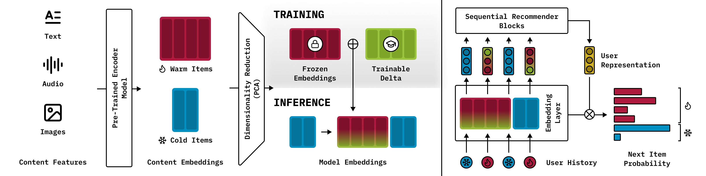
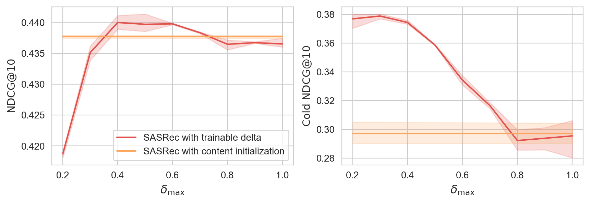

# Let It Go? Not Quite: Addressing Item Cold Start in Sequential Recommendations with Content-Based Initialization



### Abstract

Many sequential recommender systems suffer from the cold start problem, where items with few or no interactions cannot be effectively used by the model due to the absence of a trained embedding. Content-based approaches, which leverage item metadata, are commonly used in such scenarios. One possible way is to use embeddings derived from content features such as textual descriptions as initialization for the model embeddings. However, directly using frozen content embeddings often results in suboptimal performance, as they may not fully adapt to the recommendation task. On the other hand, fine-tuning these embeddings can degrade performance for cold-start items, as item representations may drift far from their original structure after training.

We propose a novel approach to address this limitation. Instead of fully freezing the content embeddings or fine-tuning them extensively, we introduce a small trainable delta to frozen embeddings that enables the model to adapt item representations without letting them go too far from their original semantic structure. This approach demonstrates consistent improvements across multiple datasets and modalities, including e-commerce datasets with textual descriptions and a music dataset with audio-based representation.

### Experiments

We use [hydra](https://hydra.cc/) to manage experiments. Example configuration files can be found in the `configs/` directory.

To run the experiments, use the following commands:

```bash
# SASRec
python run.py dataset=<DATASET>

# SASRec with content initialization
python run.py dataset=<DATASET> use_pretrained_item_embeddings=True

# SASRec with trainable delta
python run.py dataset=<DATASET> use_pretrained_item_embeddings=True train_delta=True
```

To run all experiments on multiple random seeds, use the provided script:

```bash
bash run.sh <DATASET>
```

**Note:** by default, $\delta_{\text{max}}$ is set to 0.5. You can easily specify a different value using the `max_delta_norm` argument.  

Keep in mind that the higher the value, the more the learned item embeddings deviate from the original content embeddings.  

The overall relationship is described by the following expression:

$$
\min_{\theta} \mathrm{sim}(\mathbf{c}^i, \mathbf{e}^i) = \sqrt{1 - \delta_i^2}
$$

where:
- $\mathbf{c}^i$ is the original content embedding,  
- $\mathbf{e}^i = \mathbf{c}^i + \mathbf{d}^i$ is the adjusted item embedding,  
- $\mathbf{d}^i$ is the correction vector with $\|\mathbf{d}^i\| = \delta_i$, where $0 < \delta_i \leq \delta_{\text{max}}$,  
- $\theta$ is the angle between the vectors $\mathbf{c}^i$ and $\mathbf{d}^i$.


### Results
| Model | Metric | Amazon‑M2 (Cold) | Amazon‑M2 (Warm) | Amazon‑M2 (Total) | Beauty (Cold) | Beauty (Warm) | Beauty (Total) | Zvuk (Cold) | Zvuk (Warm) | Zvuk (Total) |
|-------|--------|------------------|------------------|-------------------|---------------|---------------|----------------|-------------|-------------|--------------|
| **Baseline** | NDCG@10 | 0.3124 ± 0.0000 | 0.2320 ± 0.0000 | 0.2376 ± 0.0000 | 0.0217 ± 0.0000 | 0.0241 ± 0.0000 | 0.0235 ± 0.0000 | 0.0064 ± 0.0000 | 0.0000 ± 0.0000 | 0.0008 ± 0.0000 |
| **Baseline** | HR@10   | 0.4540 ± 0.0000 | 0.3829 ± 0.0000 | 0.3879 ± 0.0000 | 0.0428 ± 0.0000 | 0.0438 ± 0.0000 | 0.0436 ± 0.0000 | 0.0091 ± 0.0000 | 0.0000 ± 0.0000 | 0.0012 ± 0.0000 |
| **SASRec** | NDCG@10 | 0.0000 ± 0.0000 | 0.4375 ± 0.0017 | 0.4067 ± 0.0016 | 0.0000 ± 0.0000 | 0.0432 ± 0.0009 | 0.0325 ± 0.0007 | 0.0000 ± 0.0000 | 0.0627 ± 0.0014 | 0.0548 ± 0.0012 |
| **SASRec** | HR@10   | 0.0000 ± 0.0000 | 0.6100 ± 0.0026 | 0.5670 ± 0.0024 | 0.0000 ± 0.0000 | 0.0722 ± 0.0014 | 0.0542 ± 0.0010 | 0.0000 ± 0.0000 | 0.0940 ± 0.0029 | 0.0821 ± 0.0025 |
| **SASRec with<br>content initialization** | NDCG@10 | 0.2973 ± 0.0096 | 0.4483 ± 0.0009 | 0.4377 ± 0.0003 | 0.0184 ± 0.0023 | 0.0527 ± 0.0012 | 0.0442 ± 0.0014 | 0.0135 ± 0.0018 | 0.0577 ± 0.0015 | 0.0521 ± 0.0014 |
| **SASRec with<br>content initialization** | HR@10   | 0.4345 ± 0.0154 | 0.6196 ± 0.0016 | 0.6066 ± 0.0009 | 0.0318 ± 0.0041 | 0.0884 ± 0.0021 | 0.0743 ± 0.0024 | 0.0227 ± 0.0031 | 0.0882 ± 0.0017 | 0.0799 ± 0.0017 |
| **SASRec with<br>trainable delta (our)** | NDCG@10 | 0.3587 ± 0.0004 | 0.4458 ± 0.0016 | 0.4397 ± 0.0015 | 0.0224 ± 0.0039 | 0.0537 ± 0.0012 | 0.0459 ± 0.0019 | 0.0212 ± 0.0020 | 0.0603 ± 0.0019 | 0.0553 ± 0.0017 |
| **SASRec with<br>trainable delta (our)** | HR@10   | 0.5085 ± 0.0049 | 0.6168 ± 0.0020 | 0.6092 ± 0.0016 | 0.0382 ± 0.0075 | 0.0915 ± 0.0023 | 0.0782 ± 0.0034 | 0.0344 ± 0.0024 | 0.0940 ± 0.0021 | 0.0865 ± 0.0020 |

**Table 1.** Experimental results on Amazon-M2, Beauty, and Zvuk datasets.


**Figure 1.** NDCG@10 as a function of $\delta_{\text{max}}$ (Amazon-M2).


**Figure 2.** Model performance on low-frequency items (Amazon-M2). Absolute metric values for each model (left) and corresponding values relative to the original SASRec model (right).

### Data Availability
The processed datasets and embeddings are available on [Google Drive](https://drive.google.com/drive/folders/1Xq6CsBxf5R8_yKram9qUQvyzVt5FOyIN?usp=sharing).
